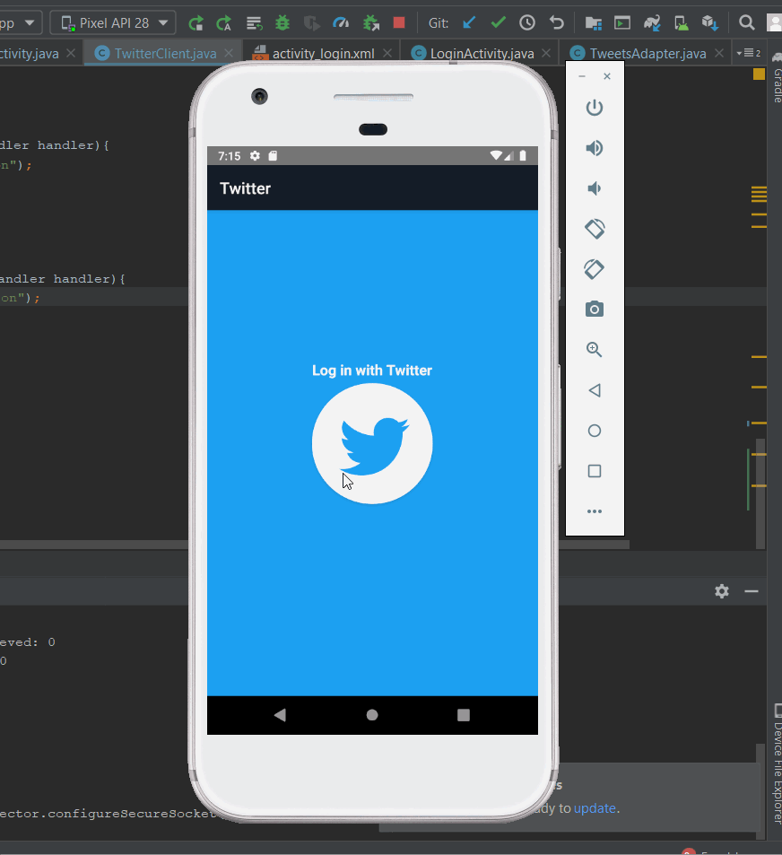

# *Twitter*

**Twitter** is an android app that allows the user view tweets from their home timeline using the Twitter API.

Submitted by: **Aaron Christson**

Time spent: **8** hours spent in total

## User Stories

The following **required** functionality is completed:

* [x] User can sign in to Twitter using OAuth login
* [x] User can view the tweets from their home timeline 
* [x] User can refresh tweets timeline by pulling down to refresh (i.e pull-to-refresh)

The following **optional** features are implemented:
* [x] User can view more tweets as they scroll with infinite pagination
* [x] Improve the user interface and theme the app to feel "twitter branded"
* [x] Links in tweets are clickable and will launch the web browser 

## Video Walkthrough

Here's a walkthrough of implemented user stories:

GIF created with [LiceCap](http://www.cockos.com/licecap/).

